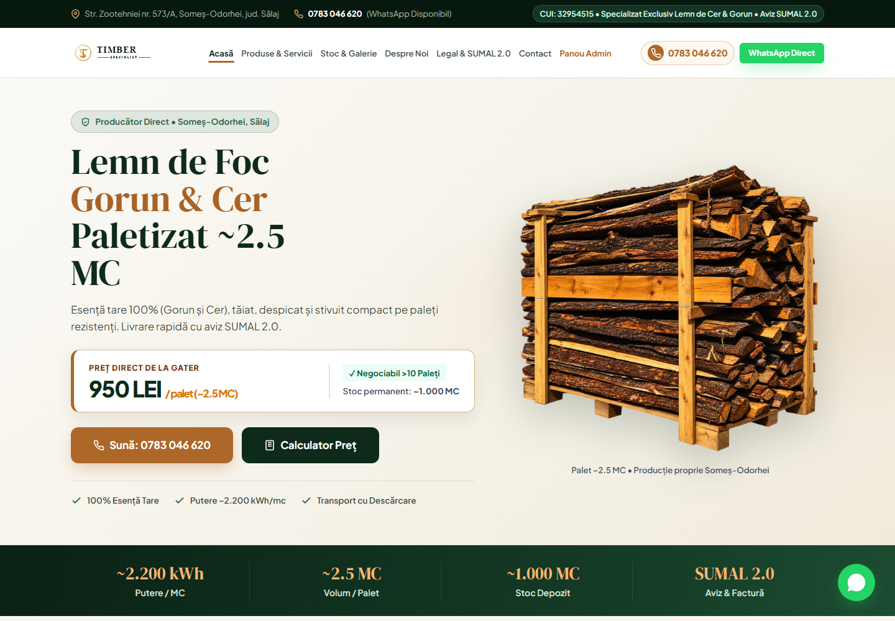
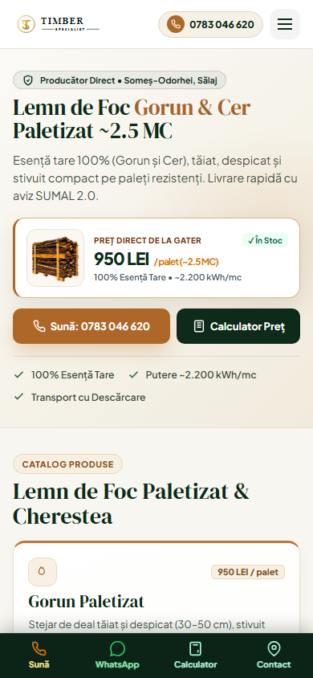
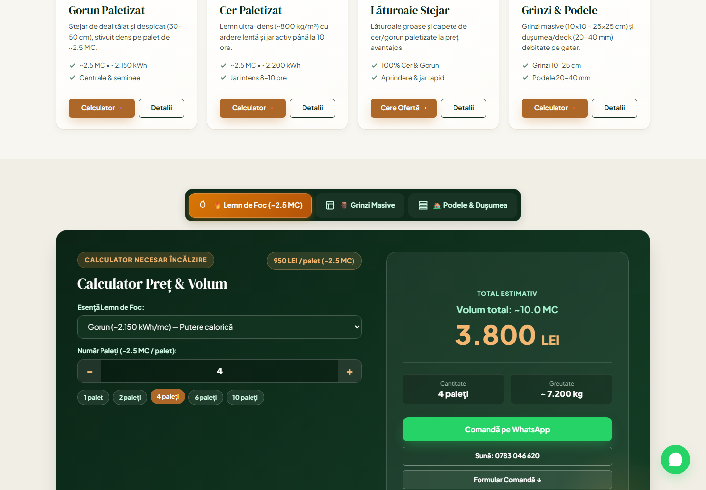
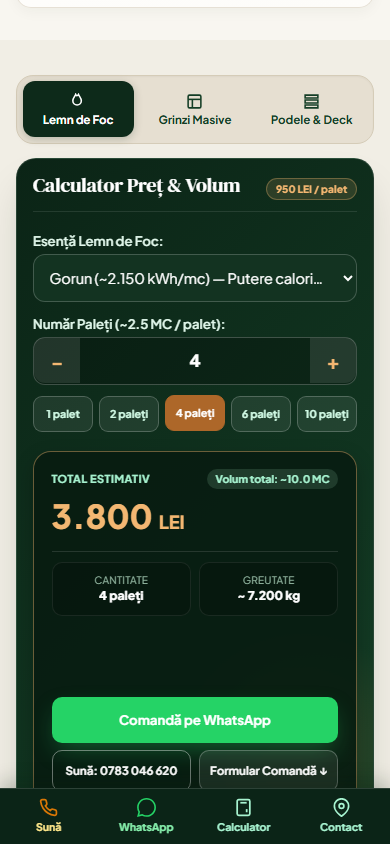
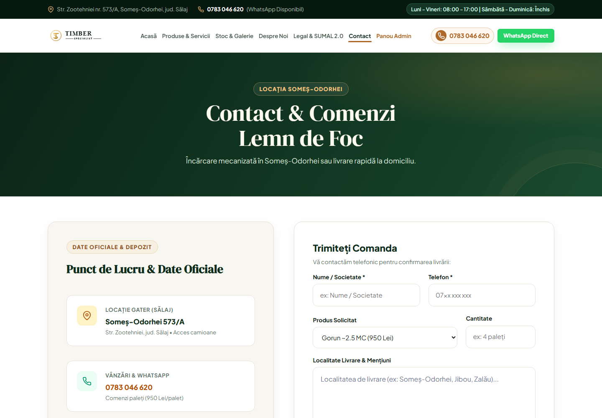
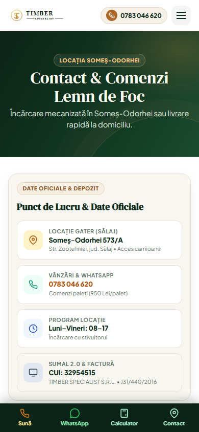
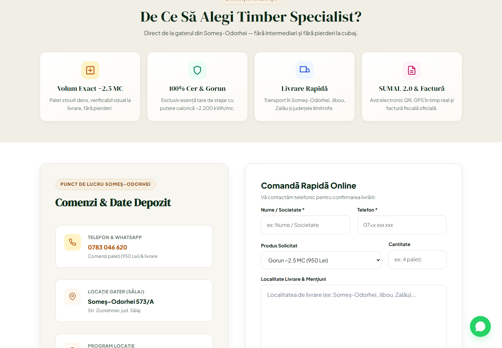
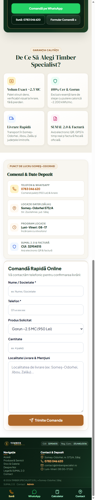
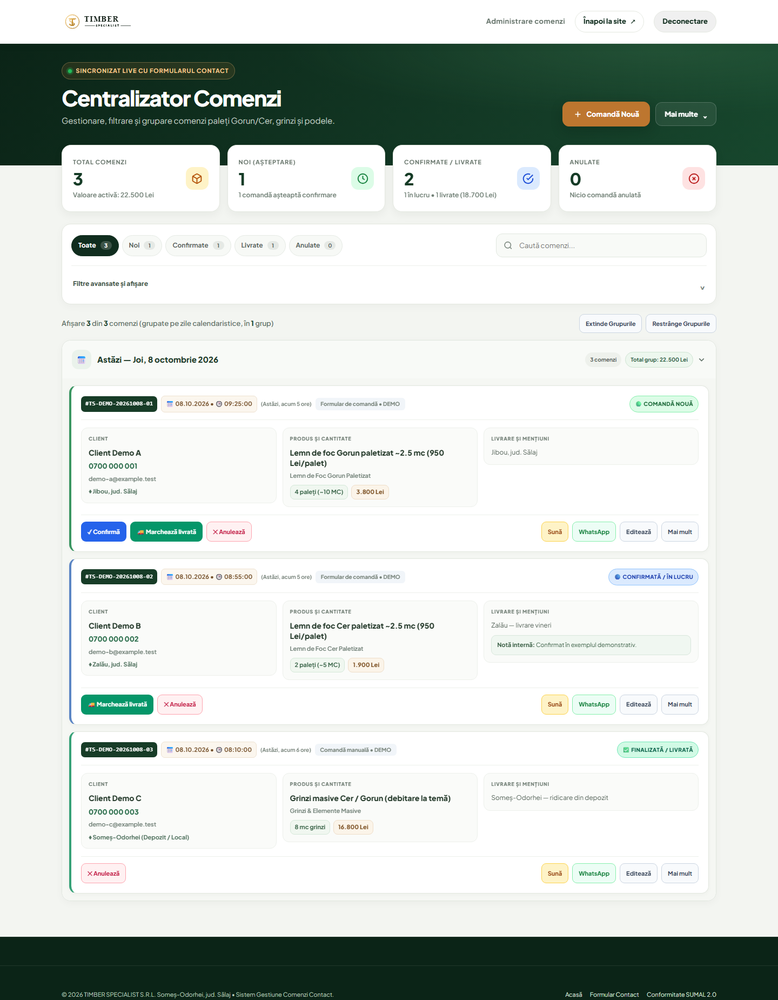
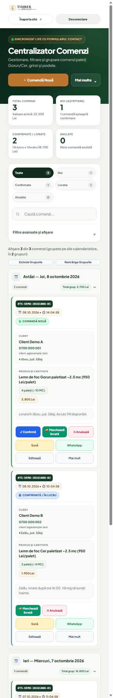

# TIMBER SPECIALIST

Website de prezentare și comandă pentru lemn de foc paletizat, grinzi și podele din Gorun și Cer, produs în Someș-Odorhei, Sălaj.

## Capturi de pe site

### Pagina principală

  
  

### Calculator de volum și preț

  
  

### Contact și comandă

  
  

### Formularul Comandă Rapidă Online

  
  

### Panou administrativ

Capturile de mai jos folosesc comenzi demonstrative cu date de contact fictive.

  
  

## Funcționalități

- Catalog de produse și servicii, galerie de stocuri și pagini de conformitate SUMAL 2.0.
- Calculatoare separate pentru paleți, grinzi și podele, cu estimări de volum și preț.
- Formulare de comandă, linkuri directe pentru telefon și WhatsApp, hartă și navigare către depozit.
- Panou intern pentru administrarea comenzilor, disponibil după autentificare.
- Interfață responsive pentru desktop și mobil.

## Tehnologii

HTML, CSS și JavaScript fără framework pentru interfață; PHP 8.3 pentru formular și API-ul comenzilor; Cloudflare Workers, Containers, D1 și Email Service pentru infrastructura de producție.

## Rulare locală

Pagini HTML pot fi previzualizate cu orice server static. Formularele și panoul admin au nevoie de PHP activ; pentru infrastructura Cloudflare completă ai nevoie de Node.js, Wrangler și Docker Desktop.

Comenzile din modul PHP obișnuit sunt stocate în `data/orders.json`, fișier exclus din Git. Configurația Cloudflare folosește D1 persistent și nu expune fișierul local. Comenzile locale nu sunt importate la deploy.

## Deploy Cloudflare

Configurația inițială, secretele necesare, baza D1, emailul, domeniul și comenzile de deploy sunt descrise în [ghidul Cloudflare](cloudflare/README.md).

## Capturile

Imaginile din `screenshots/` au fost capturate din versiunea locală a site-ului, la viewport-uri de desktop și mobil.
